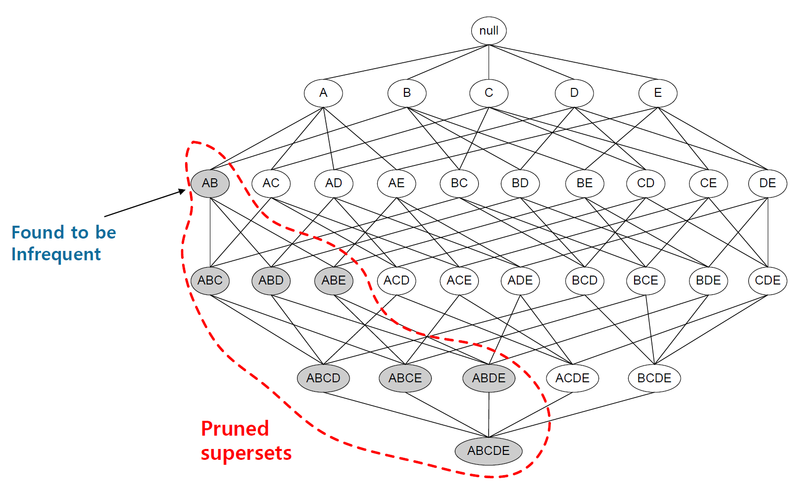

# 정형 데이터마이닝
## 데이터 분할과 성과분석
### 데이터 분할
#### sample
<b>[함수사용법]</b>
```{}
sample(x, size, replace=FALSE, prob...)
```
__Q. credit 데이터를 train, validation, test로 분할해보자.__
```{r}
credit.df<-read.csv("./data/german_credit_dataset.csv", header=TRUE, sep=",")
str(credit.df)

set.seed(1111)
idx<-sample(3, nrow(credit.df), replace=TRUE, prob=c(0.5,0.3,0.2))
train<-credit.df[idx==1,]
validation<-credit.df[idx==2,]
test<-credit.df[idx==3,]
```

```{r}
nrow(train)
nrow(validation)
nrow(test)
```

#### createDataPartition
- caret 패키지에서 목적변수를 고려한 데이터 분리를 지원하며, 함수를 사용해 분리한 데이터는 변수값의 비율이 원본 데이터와 같게 유지된다. 
- <b>[함수사용법]</b>
```{}
createDataPartition(y, times, p, list=TRUE, ...)
```

__Q. credit 데이터를 train, test로 분할해 보자.__
```{r}
install.packages(setdiff("caret", rownames(installed.packages())))
library(caret)
# 목적변수로 credit.rating을 지정, 생성할 데이터 분할은 1개로 지정, 훈련데이터는 70%로 설정
part<-createDataPartition(credit.df$credit.rating, times=1, p=0.7)
parts<-as.vector(part$Resample1)
train<-credit.df[parts,]
test<-credit.df[-parts,]
```

### 성과분석

#### 오분류표 (Confusion Matrix)
##### 개념
- 목표 변수의 <b>실제 범주</b>와 <b>모형에 의해 예측된 분류 범주</b> 사이의 관계를 나타내는 표
- TP (True Positive)<br/>
TN (True Negative)<br/>
FP (False Positive)<br/>
FN (False Negative)

##### 분석 지표
- 정분류율 : 전체 관측치 중 실제값과 예측치가 일치한 정도<br/>
$Accuracy=\frac{TN+TP}{TN+TP+FN+FP}$
- 오분류율 : 전체 관측치 중 실제값과 예측치가 다른 정도<br/>
$1 - Accuracy$
- 민감도 (Sensitivity (TPR: True Positive Rate)) : 실제값이 True인 관측치 중 예측치가 적중한 정도<br/>
$Sensitivity=\frac{TP}{TP+FN}$
- 특이도 (Specificity (TNR: True Negative Rate)) : 실제값이 False인 관측치 중 예측치가 적중한 정도<br/>
$Specificity=\frac{TN}{TN+FP}$
- 정확도 (Precision) : True로 예측된 것 중 실제로 True인 것들의 비율<br/>
$Precision=\frac{TP}{TP+FP}$
- 재현율 (Recall) : 실제 True인 값 중 True를 얼마나 찾았는지에 대한 비율<br/>
$Recall=\frac{TP}{TP+FN} (=Sensitivity)$
- F1-score : 정확도와 재현율을 보정하여 하나의 지표로 나타낸 값<br/>
$F_{1}=2\times \frac{Precision \times Recall}{Precision+Recall}$

- <b>[함수사용법]</b>
```{}
confusionMatrix(data, reference)
```

__Q. 임의의 값을 활용하여 Confusion Matrix를 그려보자.__
```{r}
install.packages(setdiff("caret", rownames(installed.packages())))
library(caret)
predicted<-factor(c(1,0,0,1,1,1,0,0,0,1,1,1))
actual<-factor(c(1,0,0,1,1,0,1,1,0,1,1,1))
xtabs(~predicted + actual)
```

```{r}
sum(predicted==actual)/NROW(actual) # 정분류율을 직접 식으로 계산
confusionMatrix(predicted, actual)
```

#### ROC 그래프
-  ROC 그래프의 x축에는 FP Ratio(1-특이도)를 나타내며, y축에는 민감도를 나타내 이 두 평가값의 관계로 모형을 평가한다. 
- 모형의 성과를 평가하는 기준은 ROC 그래프의 밑부분 면적이며, 면적이 넓을수록 좋은 모형으로 평가한다. 
- <b>[함수사용법]</b>
```{}
prediction(predictions, labels)
```

```{}
performance(prediction.object, acc(accuracy), fpr(FP Rate), tpr(TP Rate), ...)
```

__Q. 임의의 값으로 ROC Curve를 그려보자.__
```{r}
library(ROCR)
set.seed(12345)
probability<-runif(100)
(labels<-ifelse(probability>0.5&runif(100)<0.4, 1, 2))
pred<-prediction(probability, labels)
plot(performance(pred, "tpr", "fpr"))
performance(pred, "auc")@y.values # AUROC
```


## 분류 분석
분류 분석은 반응변수의 속성값에 대해 다양한 변수를 이용하여 모형을 구축하고 이를 사용해 새로운 자료에 대한 예측 및 분류를 수행하는 분석이다. 반응변수가 범주형인 경우의 예측 모형은 새로 입력되는 자료에 대한 분류가 주목적이며, 반응변수가 연속형인 경우에는 그 값을 예측하는 것이 주목적이다. 예측 민 분류 기법은 목표 마케팅, 성과예측, 의학진단, 사기검출, 제조 등 다양한 분야에 이용되고 있다. 

### 로지스틱 회귀분석

- 로지스틱 회귀모형은 반응변수가 범주형인 경우에 적용되는 회귀분석 모형이다. 이 방법은 새로운 설명변수의 값이 주어질 때 반응변수의 각 범주에 속할 확률이 얼마인지를 추정하여, 추정 확률을 기준치에 따라분류하는 목적으로 활용된다. 이 때, 모형의 적합을 통해 추정된 확률을 사후확률 (Posterior Probability)라고 한다. 
- 반응변수 y에 대한 다중 로지스틱 회귀모형은 다음과 같다. 
- 로지스틱 회귀모형은 오즈(odds)의 관점에서 해석이 가능하다. exp($\beta_{1}$)의 의미는 나머지 변수(x~1~, ...,x~k~)가 주어질 때, 한단위 증가할 때마다 성공(y=1)의 오즈가 몇 배 증가하는지를 나타내는 값이다. 
- 오즈비(odds ratio) : 오즈는 성공할 확률이 실패할 확률의 몇배인지를 나타내는 확률이며, 오즈비는 오즈의 비율이다. 

#### R을 이용한 이항 로지스틱 회귀분석

<b>[함수사용법]</b>
```{}
glm(formula, data, family="binomial"...)
```
|인자|설명|
|----|----|
|formula|수식(종속변수~독립변수)|
|data|분석하고자 하는 데이터|
|family|분석에 따른 link function 선택, binomial(이항), gaussian(가우시안), Gamma(감마), poisson(포아송) 등이 있음.|

```{}
predict(model, newdata, type, ...)
```
|인자|설명|
|----|----|
|model|개발한 모형|
|newdata|예측을 수행할 test 데이터|
|type|예측 결과의 유형 지정, link(log-odds값), class(범주형(factor)값), response(0~1 확률값)|

__Q. credit 데이터를 분할하고, train 데이터로 로지스틱 회귀모델을 만들어 보자.__

```{r}
credit<-read.csv("./data/credit_final.csv")
class(credit$credit.rating) # 종속변수 factor 변환
credit$credit.rating<-factor(credit$credit.rating)
str(credit)

set.seed(123)
idx<-sample(1:nrow(credit), nrow(credit)*0.7, replace=FALSE)
train<-credit[idx,]
test<-credit[-idx,]

logistic<-glm(credit.rating~.,data=train,family="binomial")
summary(logistic)
```

- 회귀계수의 p-value가 유의수준 0.05보다 높게 나타나는 변수가 많으므로, step 함수에서 단계적 선택법을 이용하여 로지스틱 회귀분석을 다시 실시한다. 

```{r}
step.logistic<-step(glm(credit.rating~1, data=train, family="binomial"), 
  scope=list(lower~1, upper=~account.balance+credit.duration.months+previous.credit.payment.status+credit.purpose+credit.amount+savings+employment.duration+installment.rate+marital.status+guarantor+residence.duration+current.assets+age+other.credits+apartment.type+bank.credits+occupation+dependents+telephone+foreign.worker), direction="both")

summary(step.logistic)
```

- 총 20개의 독립변수 중 13개의 독립변수가 선택되었으며, *과 .은 각 유의확률에서 채택이 되는지를 알 수 있다. 로지스틱 회귀식은 아래와 같이 나타난다. <br/>
$P(credit.rating)=\frac{1}{1+exp[-(-1.45+0.88account.balance+...-0.15installment.rate)]}$
- estimate가 양수이면 독립변수가 1단위 증가할 때 확률이 1에 가까워지고, estimate가 음수이면 독립변수가 1단위 증가할 때 확률이 0에 가까워진다. 

```{r}
library(caret)
(pred<-predict(step.logistic, test[,-1], type="response")) # 예측값을 "response"로 지정하여 확률값을 출력
```


```{r}
pred1<-as.data.frame(pred)
pred1$grade<-ifelse(pred1$pred<0.5, pred1$grade<-0, pred1$grade<-1)
confusionMatrix(data=as.factor(pred1$grade), reference=test[,1], positive='1')
```

- 구축된 로지스틱 회귀모형으로 test 데이터의 기존 credit.rating 열을 제외한 데이터로 예측을 한다. 정분류율을 확인하기 전에 예측값이 확률로 나타나기 때문에 기준이 되는 확률보다 크면 1, 작으면 0으로 범주를 추가한다. 
- 정분류율(Accuracy)은 0.75이며, 민감도는 0.8878로 높게 나타났다. 또 특이도는 0.4526이다. 정확도가 높다고 해서 무조건 좋은 모형은 아니며, 분석 분야에 따라 다양한 지표들을 활용하여 분석 모형을 선택할 수 있다. 

```{r}
install.packages(setdiff("ROCR", rownames(installed.packages())))
library(ROCR)
pred.logistic.roc<-prediction(as.numeric(pred1$grade), as.numeric(test[,1]))
plot(performance(pred.logistic.roc, "tpr", "fpr"))
abline(a=0, b=1, lty=2, col="black")
performance(pred.logistic.roc,"auc")@y.values
```

- prediction 함수와 performance 함수로 값을 구하여 plot 함수로 ROC 커브를 그렸으며, AUC값은 @y.values값으로 확인할 결과 0.67로 나타났다. 

#### R을 이용한 다항 로지스틱 회귀분석

- 예측하고자 하는 분류가 3개 이상이 된다면 다항 로지스틱 회귀분석을 사용한다. R에서는 <b>nnet 패키지의 multinom</b> 등의 함수로 분석을 한다. 

```{}
multinom(formula, data)
```

__Q. iris 데이터의 Species를 분류하는 다항 로지스틱 회귀분석을 실시하고 오분류표를 만들어 보자.__
```{r}
idx<-sample(1:nrow(iris), nrow(iris)*0.7, replace=FALSE)
train.iris<-iris[idx,]
test.iris<-iris[-idx,]

library(nnet)
mul.iris<-multinom(Species~., train.iris)

# 예측을 통한 정분류율 확인
pred.mul<-predict(mul.iris, test.iris[,-5])
confusionMatrix(pred.mul, test.iris[,5])
```

### 의사결정나무

- 의사결정나무는 분류함수를 의사결정 규칙으로 이뤄진 나무 모양으로 그리는 방법이다. 계산 결과가 의사결정나무에 직접 나타나기 때문에 해석이 간편하다. 
- 의사결정나무는 주어진 입력값에 대하여 출력값을 예측하는 모형으로 분류나무와 회귀나무 모형이 있다. 

#### 의사결정나무의 분석 과정

- 의사결정나무의 형성과정은 크게 성장, 가지치기, 타당성 평가, 해석 및 예측으로 이루어진다. 

##### 성장단계
- 각 마디에서 적절한 최적의 분류규칙을 찾아서 나무를 성장시키는 과정으로 적절한 정지규칙을 만족하면 중단한다. 
- 분리 규칙을 설정하는 분리 기준은 이산형 목표변수, 연속형 목표변수에 따라 나뉘며 아래와 같은 기준값을 사용한다. 

- 이산형 목표변수
  
| 기준값|분리기준 |
|-------|---------|
|카이제곱 통계량 p값|p값이 가장 작은 예측변수와 그때의 최적분리에 의해서 자식마디를 형성|
|지니 지수|지니 지수를 감소시켜주는 예측변수와 그 때의 최적 분리에 의해서 자식 마디를 형성|
|엔트로피 지수|엔트로피 지수가 가장 작은 예측 변수와 이 때의 최적분리에 의해 자식 마디를 형성|

- 연속형 목표변수
  
| 기준값|분리기준 |
|-------|---------|
|분산분석에서 F통계량|p값이 가장 작은 예측변수와 그때의 최적분리에 의해서 자식마디를 형성|
|분산의 감소량|분산의 감소량을 최대화 하는 기준의 최적분리에 의해서 자식마디를 형성|

- 정지규칙은 더 이상 분리가 일어나지 않고, 현재의 마디가 끝마디가 되도록 하는 규칙이며, 의사결정나무의 깊이를 지정하거나 끝마디의 레코드 수의 최소 개수를 지정한다. 

##### 가지치기 단계
- 오차를 크게 할 위험이 높거나 부적절한 추론 규칙을 가지고 있는 가지 또는 불필요한 가지를 제거하는 단계이다. 
- 나무의 크기를 모형의 복잡도로 볼 수 있으며, 최적의 나무 크기는 자료로부터 추정하게 된다. 일반적으로 사용되는 방법은 마디에 속하는 자료가 일정수 이하일 때 분할을 정지하고 비용-복잡도 가지치기를 이용하여 성장시킨 나무를 가지치기하게 된다. 

##### 타당성 평가 단계

- 이익도표, 위험도표 혹은 시험자료를 이용하여 의사결정나무를 평가하는 단계이다. 

##### 해설 및 예측 단계
- 구축된 나무모형을 해석하고 예측모형을 설정한 후 예측에 적용하는 단계이다. 

#### 의사결정나무 알고리즘
##### CART (Classification and Regression Tree)
##### C4.5와 C5.0
##### CHAID (SHi-squared Automatic Interaction Detection)

#### R을 이용한 의사결정나무 분석

<b>[함수사용법]</b>
```{}
rpart(formula, data, method, control=rpart.control(), ...)
```

__Q. 앞서 분할한 credit 데이터의 train 데이터로 의사결정나무 모델을 만들어 보자.__
```{r}
library(rpart)
library(rpart.plot)
dt.model<-rpart(credit.rating~., method="class", data=train, control=rpart.control(maxdepth=5, minsplit=15))
prp(dt.model, type=4, extra=2)
```

- 총 700개의 관측치 중 495개의 관측치를 1로 분류했으며, account.balance >= 3인 325개의 노드 중 288이 1로 분류되었음을 의미한다. prp 함수는 rpart.plot 패키지에 속한 함수이며, type, extra 등의 인자를 사용하여 그래프의 모양을 바꿀 수 있다. 

```{r}
# rpart 함수를 활용하여 의사결정나무분석 실시 (최적 나무 선정)
dt.model$cptable
(opt<-which.min(dt.model$cptable[,"xerror"]))
(cp<-dt.model$cptable[opt, "CP"])
(prune.c<-prune(dt.model, cp=cp))
```

- cptable 인자를 통해서 교차타당성 오차를 제공하여 의사결정나무 모델의 가지치기, 트리의 최대 크기조절에 사용한다. nsplit은 분할횟수, xerror는 해당 CP에서 cross validation 했을 때 오류율, xstd는 해당 CP에서 cross validation 했을 때 편차를 나타낸다. cptable에서 xerror가 가장 낮은 split 개수를 선택한다. 

- 위 결과를 확인했을 때, xerror가 가장 낮을 때 nsplit은 5이며, 앞선 모형의 그래프를 봤을 때 의사 결정나무 모델이 분할을 5번까지 한다고 할 수 있다. 

```{r}
plotcp(dt.model)
```

- plotcp의 결과에서도 xerror가 가장 낮을 때 결과에 따라 교차타당성오차를 최소로 하는 트리를 형성한다. 결과적으로 나무의 크기가 6일 때 최적의 나무라고 할 수 있다. 

```{r}
install.packages(setdiff("caret", rownames(installed.packages())))
library(caret)
pred.dt<-predict(dt.model, test[,-1], type="class")
confusionMatrix(data=pred.dt, reference=test[,1], positive='1')
```

- 정분류율(Accuracy)은 0.7533며, 민감도는 0.8976로 높게 나타났다. 또, 특이도는 0.4421이다. 정확도가 높다고 해서 무조건 좋은 모형은 아니며, 분석 분야에 따라 다양한 지표들을 활용하여 분석모형을 선택할 수 있다. 

```{r}
# ROC 커브 그리기 및 AUC 산출
install.packages(setdiff("ROCR", rownames(installed.packages())))
library(ROCR)
pred.dt.roc<-prediction(as.numeric(pred.dt), as.numeric(test[,1]))
plot(performance(pred.dt.roc,"tpr", "fpr"))
abline(a=0,b=1,lty=2,col="black")
performance(pred.dt.roc,"auc")@y.values
```

- prediction 함수와 performance 함수로 값을 구하여 plot 함수로 ROC 커브를 그렸으며, AUC값은 @y.values값으로 확인한 결과 0.6698로 나타났다. 

__Q. 앞서 분리한 iris 데이터의 Species를 분류하는 의사결정나무분석을 실시하고 오분류표를 만들어 보자.__
```{r}
install.packages(setdiff("rpart", rownames(installed.packages())))
library(rpart)
library(rpart.plot)
dt.model2<-rpart(Species~., data=train.iris)
prp(dt.model2, type=4, extra=2)
```

```{r}
pred.dt2<-predict(dt.model2, test.iris[,-5], type="class")
confusionMatrix(data=pred.dt2, reference=test.iris[,5])
```


### 앙상블 기법
- 앙상블 기법은 주어진 자료로부터 여러개의 예측모형들을 만든 후 예측모형들을 조합하여 하나의 최종 예측모형을 만드는 방법이다. 학습방법이 가장 불안전한 의사결정나무에 주로 사용한다. 

#### 배깅 (Bagging)
##### 개념

- 주어진 자료에서 여러개의 부트스트랩 자료를 생성하고 각 부트스트랩 자료에 예측모형을 만든후 결합하여 최종 예측모형을 만드는 방법이다. 
- 보팅은 여러개의 모형으로부터 산출된 결과 중 다수결에 의해서 최종 결과를 선정하는 과정이다. 
- 최적의 의사결정나무를 구축할 때 가장 어려운 부분이 가지치기이지만 배깅에서는 가지치기를 하지 않고 최대로 성정한 의사결정나무들을 활용한다. 
- 훈련자료의 모집단의 분포를 모르기 때문에 실제 문제에서는 평균예측모형을 구할 수 없다. 배깅은 이러한 문제를 해결하기 위해 훈련자료를 모집단으로 생각하고 평균예측모형을 구하여 분산을 줄이고 예측력을 향상시킬 수 있다. 

##### R을 이용한 Bagging 분석
```{}
bagging(formula, data, mfinal, control=, ...)
```

|인자|설명|
|----|----|
|formula|수식|
|data|분석하고자하는 데이터|
|mfinal|반복수 또는 사용할 트리의 수 (default=100)|
|control|의사결정나무를 만들 때 사용할 option을 설정

__Q. 앞서 분할한 credit 데이터의 train 데이터로 Bagging 모델을 만들어 보자.__
```{r}
install.packages(setdiff("adabag", rownames(installed.packages())))
library(adabag)
bag<-bagging(credit.rating~., data=train, mfinal=15)
names(bag)
```

- names 함수를 통해 bagging 함수로 생성된 결과들에 어떤 것들이 있는지 확인이 가능하다. 주로 사용하는 인자들에 대한 설명은 아래와 같다. 
  + trees: bagging을 통해 생성된 의사결정나무들을 확인할 수 있다. 
  + votes: 각 의사결정나무들이 1행 데이터에 대해 1 또는 2열의 분류를 가진다는 것에 대한 투표를 진행한 것이다.
  + prob: 각 행에 대해 1 또는 2열의 특징으로 분류되는 확률을 나타내는 것이다. 
  + class: bagging 기법을 활용해 각 행의 분류를 예측한 것이다. 
  + samples: 각 의사결정나무에 사용된 부트스트랩 데이터의 레코드 번호를 나타낸다. 
  + importance: 변수의 상대적인 중요도를 나타내며, 지니지수의 gain을 고려한 측도이다. 

```{r}
bag$importance
```

- importance 인자에서 변수의 상대적 중요도를 봤을 때, account.balance, credit.duration.months, age 순서로 변수 중요도가 크다는 것을 파악할 수 있다. 

```{r}
library(caret)
pred.bg<-predict(bag, test, type="class")
confusionMatrix(data=as.factor(pred.bg$class), reference=test$credit.rating, positive='1')
```

- 로지스틱 회귀모형, 의사결정나무 모형과 동일한 형태로 정분류율을 확인할 수 있으며, 분석 결과에서 예측한 값의 class가 numeric형이므로 as.factor 함수를 이용하여 factor로 변형을 해야 한다. 
- 정분류율은 0.7467이며, 민감도는 0.8488로 높게 나타났다. 또, 특이도는 0.5263이다. 정확도가 높다고 해서 무조건 좋은 모형은 아니며, 분석 분야에 따라 다양한 지표들을 활용하여 분석모형을 선택할 수 있다. 

```{r}
library(ROCR)
pred.bg.roc<-prediction(as.numeric(pred.bg$class), as.numeric(test[,1]))
plot(performance(pred.bg.roc, "tpr", "fpr"))
abline(a=0, b=1, lty=2, col="black")
performance(pred.bg.roc, "auc")@y.values
```

- prediction 함수와 performance 함수로 값을 구하여 plot 함수로 ROC 커브를 그렸으며, AUC값은 @y.values값으로 확인한 결과 0.6875로 나타났다.


#### 부스팅 (Boosting)
##### 개념

- 예측력이 약한 모형들을 결합하여 강한 예측모형을 만드는 방법으로 Adaboost는 이진분류 문제에서 랜덤 분류기보다 조금 더 좋은 분류기 n개에 각각 가중치를 설정하고 n개의 분류기를 결합하여 최종 분류기를 만드는 방법을 제안하였다. 
- 훈련오차를 빨리, 쉽게 줄일 수 있고 배깅에 비해 많은 경우 예측오차가 향상되어 Adaboost의 성능이 배깅보다 뛰어난 경우가 많다. 

##### R을 이용한 Boosting 분석

<b>[함수사용법]</b>
```{}
boosting(formula, data, boos=TRUE/FALSE, control=, ...)
```

__Q. 앞서 분할한 credit 데이터의 train 데이터로 Boosting 모델을 만들어 보자.__
```{r}
library(adabag)
boost<-boosting(credit.rating ~ ., data=train, boos=TRUE, mfinal=80)
names(boost)
```

- names 함수를 통해 boosting 함수로 생성된 결과들에 어떤 것들이 있는지 확인이 가능하다. 주로 사용하는 인자들에 대한 설명은 아래와 같다. 
  + trees: boosting을 통해 생성된 의사결정나무들을 확인할 수 있다. (80개)
  + weitgts: 각 의사결정나무에 부여된 가중치값을 확인할 수 있다. 
  + votes: 각 의사결정나무들이 1행 데이터에 대해 1 또는 2열의 분류를 가진다는 것에 대한 투표를 진행한 것이다.
  + prob: 각 행에 대해 1 또는 2열의 특징으로 분류되는 확률을 나타내는 것이다. 
  + class: boosting 기법을 활용해 각 행의 분류를 예측한 것이다. 
  + importance: 변수의 상대적인 중요도를 나타내며, 지니지수의 gain을 고려한 측도이다. 

```{r}
boost$importance
```

- importance 인자에서 변수의 상대적 중요도를 봤을 때, credit.amount, age, credit.duration.months 순서로 변수 중요도가 크다는 것을 파악할 수 있다. 

```{r}
library(caret)
pred.boos<-predict(boost, test, type="class")
confusionMatrix(data=as.factor(pred.boos$class), reference=test$credit.rating, positive='1')
```

- 로지스틱 회귀모형, 의사결정나무 모형과 동일한 형태로 정분류율을 확인할 수 있으며, 분석 결과에서 예측한 값의 class가 numeric형이므로 as.factor 함수를 이용하여 factor로 변형을 해야 한다. 
- 정분류율은 0.7133이며, 민감도는 0.8098로 높게 나타났다. 또, 특이도는 0.5053이다. 정확도가 높다고 해서 무조건 좋은 모형은 아니며, 분석분야에 따라 다양한 지표들을 활용하여 분석모형을 선택할 수 있다. 

```{r}
library(ROCR)
pred.boos.roc<-prediction(as.numeric(pred.boos$class), as.numeric(test[,1]))
plot(performance(pred.boos.roc, "tpr", "fpr"))
abline(a=0, b=1, lty=2, col="black")
performance(pred.boos.roc,"auc")@y.values
```

- prediction 함수와 performance 함수로 값을 구하여 plot 함수로 ROC 커브를 그렸으며, AUC값은 @y.values값으로 확인한 결과 0.6575로 나타났다. 


#### 랜덤포레스트 (Random Forest)
##### 개념
- 의사결정나무의 특징인 분산이 크다는 점을 고려하여 배깅과 부스팅보다 더 많은 무작위성을 주어 약한 학습기들을 생성한 후 이를 선형 결합하여 최종 학습기를 만드는 방법이다. 
- R프로그램에서는 randomForest 패키지로 구현이 가능하다. randomForest 함수를 사용하고 random input에 따른 forest of tree를 생성하여 이를 이용한 분류를 한다. 
- 수천개의 변수를 통해 변수 제거없이 실행되므로 정확도 측면에서 좋은 성과를 보인다. 
- 이론적 설명이나 최종 결과에 대한 해석이 어렵다는 단점이 있지만 예측력이 매우 높은 것으로 알려져 있다. 특히 입력변수가 많은 경우, 배깅/부스팅과 비슷하거나 좋은 예측력을 보인다. 

##### R을 이용한 RandomForest 분석
- R에서 RandomForest 분석을 수행할 수 있는 함수는 randomForest 패키지의 randomForest 함수이며, 이를 이용하여 분류분석을 실시한다. 

<b>[함수사용법]</b>
```{}
randomForest(formula, data, ntree, mtry, ...)
```

|인자|설명|
|----|----|
|formula|수식(종속변수 ~ 독립변수)|
|data|분석하고자 하는 데이터|
|ntree|사용할 트리의 수, 너무 작은 숫자를 입력하면 예측 불가|
|mtry|각 분할에서 랜덤으로 뽑힌 변수의 개수<br/>보통 classification은 sqrt(변수 개수), regression은 (변수 개수/3)|

__Q. 앞서 분할한 credit 데이터의 train 데이터로 randomforest 모델을 만들어 보자.__
```{r}
library(randomForest)
(rf.model<-randomForest(credit.rating ~ ., 
                       data=train, 
                       ntree=50, # 나무 50개 사용
                       mtry=sqrt(20), # 사용할 변수의 개수 (classification이므로 sqrt(20)개)
                       importance=TRUE) # 변수중요도를 결과를 확인
)
```

- 랜덤포레스트 분석 결과에서 "OOB estimate of error rate"의 값은 에러 추정치로서 값이 낮을수록 분류모델의 성능이 좋다고 판단할 수 있다. Confusion matrix의 결과에서 class.error값으로 분류 에러를 통해 모델 성능을 확인할 수 있다. 
```{r}
names(rf.model)
```

- names 함수를 통해 randomForest 함수로 생성된 결과들에 어떤 것들이 있는지 확인이 가능하다. 주로 사용하는 인자들에 대한 설명은 아래와 같다. 
  + predicted: Out-of-bag samples에 기초한 예측값을 확인할 수 있다. 
  + err.rate: 입력데이터 각각에 대한 예측 오류율을 확인할 수 있다. 
  + importance: 변수 중요도를 나타내며 Gini값을 기준으로 한다. MeanDecreaseAccuracy와 MeanDecreaseGini 모두 값이 클수록 중요도가 높다고 해석할 수 있다. 
  
```{r}
varImpPlot(rf.model)
```

- varImpPlot 함수로 importance 인자 결과를 시각화할 수 있다. 변수의 상대적 중요도를 Mean DecreaseGini를 기준으로 봤을 때, credit.amout, age, account.balance 순서로 변수 중요도가 크다는 것을 파악할 수 있다. 

```{r}
library(caret)
pred.rf<-predict(rf.model, test[,-1], type="class")
confusionMatrix(data=pred.rf, reference=test[,1], positive='1')
```

- 정분류율은 0.76이며, 민감도는 0.8976으로 높게 나타났다. 또 특이도는 0.4632이다. 정확도가 높다고 해서 무조건 좋은 모형은 아니며, 분석분야에 따라 다양한 지표들을 활용하여 분석 모형을 선택할 수 있다. 

```{r}
library(ROCR)
pred.rf.roc<-prediction(as.numeric(pred.rf), as.numeric(test[,1]))
plot(performance(pred.rf.roc,"tpr","fpr"))
abline(a=0,b=1,lty=2,col="black")

performance(pred.rf.roc, "auc")@y.values[[1]]
```

- prediction 함수와 performance 함수로 값을 구하여 plot 함수로 ROC 커브를 그렸으며, AUC값은 @y.values값으로 확인한 결과 0.6804로 나타났다. 

__Q. 앞서 분리한 iris 데이터의 Species를 분류하는 랜덤포레스트분석을 실시하고 오분류표를 만들어 보자.__
```{r}
library(randomForest)
(rf.model2<-randomForest(Species ~ ., data=train.iris, ntree=50, mtry=sqrt(4), importance=TRUE))

pred.rf2<-predict(rf.model2, test.iris[,-5], type="class")
confusionMatrix(data=pred.rf2, reference=test.iris[,5], positive='1')
```

### SVM (Support Vector Machine)
- 서포트 벡터 머신은 기계학습 분야 중 하나로 패턴인식, 자료 분석 등을 위한 지도학습 모델이며 주로 회귀와 분류 문제 해결에 사용된다. 
- 서포트 벡터 머신 알고리즘은 주어진 데이터 집합을 바탕으로 하여 새로운 데이터가 어떤 범주에 속할 것인지를 판단하는 <b>비확률적 이진 선형 분류 모델을 생성</b>한다. 

#### 작동 원리

- 데이터의 각 그룹을 구분하는 분류자를 <b>결정 초평면</b>, 각 그룹에 속한 데이터들 중에서도 초평면에 가장 가까이에 붙어 있는 최정방 데이터들을 <b>서포트 벡터</b>, 서포트 벡터와 초평면 사이의 수직거리를 <b>마진</b>이라고 한다. 
- SVM은 고차원 혹은 무한 차원의 공간에서 <b>마진을 최대화하는 초평면 (MMH, Maximum Margin Hyperplane: 최대마진 초평면) 을 찾아 분류와 회귀를 수행</b>한다. 
- SVM 모형은 선형 분류뿐만 아니라 <b>비선형 분류</b>에서도 사용되는데, 비선형 분류에서는 입력자료를 다차원 공간상으로 매핑할 때 <b>커널 트릭</b>을 사용하기도 한다. 

#### R을 이용한 SVM 분석
<b>[함수사용법]</b>
```{}
svm(formula, data, kernel, gamma, cost, ...)
```

|인자|설명|
|----|----|
|formula|수식(종속변수 ~ 독립변수)|
|data|분석하고자 하는 데이터|
|kernel|훈련과 예측에 사용되는 커널<br/>"radial","linear","polynomial","sigmoid"가 있음.<br/>실제 문제에서 커널의 선택이 결과의 정확도에 큰 영향을 주지 않음.|
|gamma|초평면의 기울기, default=1/(데이터차원)|
|cost|과적합을 막는 정도, default=1|

```{}
tune.svm(formula, data, kernel, gamma, cost, ...)
```

|인자|설명|
|----|----|
|formula|수식(종속변수 ~ 독립변수)|
|data|분석하고자 하는 데이터|
|gamma|초평면의 기울기|
|cost|과적합을 막는 정도|

__Q. 앞서 분할한 credit 데이터의 train 데이터를 이용하여 tune.svm 함수로 최적의 파라미터를 찾고 SVM 모델을 만들어 보자.__
```{r}
install.packages(setdiff("e1071", rownames(installed.packages())))
library(e1071)
tune.svm(credit.rating ~ ., data=credit, gamma = 10^(-6:-1), cost = 10^(1:2))
```

- tune.svm 함수에서 gamma와 cost의 주어진 범위 내에서 최적값을 찾아준다. 여기서는 gamma 6개, cost 2개, 즉 6 * 12개의 조합에서 모수조율이 이루어진다. 분석결과에서 best parameters를 통해 gamma는 0.01, cost는 10이 최적의 파라미터임을 확인할 수 있다. 

```{r}
svm.model<-svm(credit.rating~., data=train, kernel="radial", gamma=0.01, cost=10)
summary(svm.model)
```

- svm 함수에서 gamma와 cost를 설정하고, kernel을 "radial"으로 지정한다. kernel은 radial (가우시안 RBF)이 default로 되어 있다. summary 함수로 svm 모델의 cost값과 Support Vectors의 수(train 데이터 수)를 확인할 수 있다. 

```{r}
# 예측을 통한 정분류를 확인
install.packages(setdiff("caret", rownames(installed.packages())))
library(caret)
pred.svm<-predict(svm.model, test, type="class")
confusionMatrix(data=pred.svm, reference=test[,1], positive='1')
```

- 정분류율을 0.7533이며, 민감도는 0.8488로 높게 나타났다. 또, 특이도는 0.5474이다. 정확도가 높다고 해서 무조건 좋은 모형은 아니며, 분석 분야에 따라 다양한 지표들을 활용하여 분석모형을 선택할 수 있다. 

```{r}
install.packages(setdiff("ROCR", rownames(installed.packages())))
library(ROCR)
pred.svm.roc<-prediction(as.numeric(pred.svm), as.numeric(test[,1]))
plot(performance(pred.svm.roc, "tpr", "fpr"))
abline(a=0, b=1, lty=2, col="black")
performance(pred.svm.roc, "auc")@y.values
```

- prediction 함수와 performance 함수로 값을 구하여 plot함수로 ROC 커브를 그렸으며, AUC값은 @y.values 값으로 확인한 결과 0.6981로 나타났다. 

__Q. 앞서 분리한 iris 데이터의 Species를 분류하는 SVM 분석을 실시하고 오분류표를 만들어 보자.__
```{r}
install.packages(setdiff("e1071", rownames(installed.packages())))
library(e1071)
tune.svm(Species ~ ., data=iris, gamma=2^(-1:1), cost=2^(2:4))
svm.model2<-svm(Species~., data=train.iris, kernel="radial", gamma=0.5, cost=16)
pred.svm2<-predict(svm.model2, test.iris, type="class")
confusionMatrix(data=pred.svm2, reference=test.iris[,5], positive='1')
```


### 나이브 베이즈 분류
- 나이브 베이즈 분류는 데이터에서 변수들에 대한 조건부 독립을 가정하는 알고리즘으로 클래스에 대한 사전 정보와 데이터로부터 추출된 정보를 결합하고, 베이즈 정리를 이용하여 특정 데이터가 어떤 클래스에 속하는지를 분류하는 알고리즘이다. 
- 텍스트 분류에서 문서를 여러 범주중 하나로 판단하는 문제에 대한 솔루션으로 사용될 수 있다. 

#### Bayes theorem

- 나이브 베이즈 알고리즘의 기본이 되는 개념으로, 두 확률 변수의 사전 확률과 사후 확률 사이의 관계를 나타내는 정리이다. 
- 사건 A와 B가 있을 때, 사건 B가 일어난 것을 전제로 한 사건 A의 조건부 확률을 구하고자 한다. 하지만 현재 가지고 있는 정보는 사건 A가 일어난 것을 전제로 한 사건 B의 조건부 확률, A의 확률, B의 확률뿐이다. 이때, 원래 구하고자 했던 '사건 B가 일어난 것을 전제로 한 사건 A의 조건부 확률'을 다음과 같이 구할 수 있다는 것이 베이즈 정리이다. <br />
$P(A|B) = \frac{P(B \cap A)}{P(B)} = \frac{P(A)P(B|A)}{P(B)}=\frac{P(A)P(B|A)}{P(A)P(B|A)+P(A^{C}P(B|A^{C}))}$

- $P(A|B)$ : 사건 B가 발생했을 때 사건 A가 발생할 확률 -> 사후확률 (posterior)
- $P(B|A)$ : 사건 A가 발생했을 때 사건 B가 발생할 확률 -> 우도 (likelihood)
- $P(A \cap B)$ : 사건 A와 B가 동시에 발생할 확률
- $P(A)$ : 사건 A가 발생할 확률 -> 사전확률 (prior)
- $P(B)$ : 사건 B가 발생할 화률 -> 관찰값 (evidence)
- 위 식을 다음과 같은 식으로도 표현이 가능하다. <br />$posterior = \frac{prior\times likelihood}{evidence}$

#### 나이브 베이즈 분류
- 나이브 베이즈 분류는 하나의 속성값을 기준으로 다른 속성이 독립적이라 전제했을 때 해당 속성 값이 클래스 분류에 미치는 영향을 측정한다. 
- 속성값에 대해 다른 속성이 독립적이라는 가정은<b>클래스 조건 독립성</b>이라 한다. 

#### R을 이용한 나이브 베이즈 분류 분석

<b>함수사용법</b>
```{}
naiveBayes(formula, data, laplace=0, ...)
```

__Q. 앞서 분할한 credit 데이터의 train 데이터로 나이브 베이즈 분류 모델을 만들어 보자.__
```{r}
library(e1071)
nb.model<-naiveBayes(credit.rating~., data=train, laplace=0)
nb.model
```

- 분석 결과에서 A-priori probabilities는 사전확률을 나타내고 있으며, Conditional probabilities로 각 변수에 대해 조건부 확률을 표로 제공하고 있다. 수치형 변수의 경우 평균, 표준편차를 제공한다. 

```{r}
# 예측을 통한 정분류율 확인
library(caret)
pred.nb<-predict(nb.model, test[, -1], type="class")
confusionMatrix(data=pred.nb, reference=test[,1], positive='1')
```

- 정분류율(Accuracy)은 0.7233이며, 민감도(Sensitivity)는 0.7415로 높게 나타났다. 또, 특이도 (Specificity)는 0.6842이다. 정확도가 높다고 해서 무조건 좋은 모형은 아니며, 분석 분야에 따라 다양한 지표들을 활용하여 분석 모형을 선택할 수 있다. 

```{r}
install.packages(setdiff("ROCR", rownames(installed.packages())))
library(ROCR)
pred.nb.roc<-prediction(as.numeric(pred.nb), as.numeric(test[,1]))
plot(performance(pred.nb.roc, "tpr", "fpr"))
abline(a=0, b=1, lty=2, col="black")
performance(pred.nb.roc, "auc")@y.values
```

- prediction 함수와 performance 함수로 값을 구하여 plot 함수로 ROC  커브를 그렸으며, AUC값은 @y.values값으로 확인한 결과 0.7128로 나타났다. 


### K-NN (K-Nearest Neighbor)
- K-NN은 어떤 범주로 나누어져 있는 데이터셋이 있을 때, 새로운 데이터가 추가된다면 이를 어떤 범주로 분류할 것인지를 결정할 때 사용할 수 있는 분류 알고리즘으로 지도학습 (Supervised Learning)의 한 종류이다. 

#### K-NN 알고리즘의 원리
- K-NN 알고리즘에서는 새로운 데이터의 클래스를 해당 데이터와 가장 가까운 K개 데이터들의 클래스(범주)로 결정한다. 
- K-NN 알고리즘에서는 최근접 이웃 간의 거리를 계산할 때 유클리디안 거리, 맨하탄 거리, 민코우스키 거리 등을 사용할 수 있으며, 대표적으로 유클리디안 거리를 사용한다. 

#### K의 선택
- K의 선택은 학습의 난이도와 데이터의 개수에 따라 결정될 수 있으며, 일반적으로는 훈련 데이터 개수의 제곱근으로 설정한다. 그리고 k를 짝수로 했을 때, 인접객체의 범주가 동률일 경우가 나오므로 반드시 홀수의 값으로 k를 선택하는 것이 중요하다. 
- K를 너무 크게 설정할 경우 주변에 있는 데이터와 근접성이 떨어져 클러스터링이 잘 이루어지지 않고, 너무 작게 설정할 경우 이상치 혹은 잡음 데이터와 이웃이 될 가능성이 있으므로 적절한 k를 선택하는 것이 중요하다.

#### R을 이용한 K-NN 분석
- knn 분석 이전에 훈련, 데스트 데이터의 종속변수를 제외한 뒤에 분석을 실시한다. 그리고 거리를 이용한 분석이므로 데이터의 형태가 범주형 변수가 아닌 수치형으로 변환되어야 한다. 

<b>함수사용법</b>
```{}
knn(train, test, cl, k, ...)
```
__Q. 앞서 분할한 credit 데이터의 train 데이터로 K-NN 모델을 만들어 보자.__
```{r}
library(class)
train.data<-train[,-1]
head(train.data)

test.data<-test[,-1]
head(test.data)

class<-train[,1]
head(class)
```

```{r}
knn.3<-knn(train.data, test.data, class, k=3)
knn.7<-knn(train.data, test.data, class, k=7)
knn.10<-knn(train.data, test.data, class, k=10)

# 각각의 k에 대해 분류 table 작성과 분류 정확도 확인
(t.1<-table(knn.3, test$credit.rating))
(t.1[1,1]+t.1[2,2])/sum(t.1)

(t.2<-table(knn.7, test$credit.rating))
(t.2[1,1]+t.2[2,2])/sum(t.2)

(t.3<-table(knn.10, test$credit.rating))
(t.3[1,1]+t.3[2,2])/sum(t.3)
```

- 분석 이전에 종속변수(credit.rating)을 제외한 데이터를 train.data와 test.data에 저장하고 class에 훈련 데이터의 종속변수를 저장한다 .그리고 k가 3, 7, 10일 때 각각 모델을 knn 함수를 사용하여 만든다. 
- 분석 결과를 확인하기 위해서 각각의 k에 대해 분류 table과 정분류율을 계산하여 가장 정분류율이 높은 모델을 찾는다. 위의 결과에서 k를 10으로 했을 때 정분류율이 67%로 가장 높게 나타났다. 

```{r}
result<-numeric()
k=3:22
for (i in k) {
  pred<-knn(train.data, test.data, class, k=i-2)
  t<-table(pred, test$credit.rating)
  result[i-2]<-(t[1,1] + t[2,2])/sum(t)
}
result
sort(result, decreasing=TRUE)
which(result==max(result))

```

- K-NN에서 최적의 K를 선정하는 것이 중요하다. 그렇기 때문에 최적의 k의 값을 선정해야 하며, 여기에서는 정분류율이 가장 높은 k가 최적의 k값이라고 선정하여 함수를 구현했다. 
- 위의 결과에서 k가 17, 19일 때 분류 정확도가 가장 좋다고 나타나며, 정분류율은 69%이다. 

### 인공신경망 모형 (Artificial Neural Network)

- 인공신경망 모형은 동물의 뇌신경계를 모방하여 분류 또는 예측하기 위해 만들어진 모형이다. 신경망에서는 입력은 인간의 뇌의 시냅스에 해당하며 개별 신호의 강도에 따라 가중되며, 활성 함수는 인공신경망의 출력을 계산한다. 
- 인공신경망은 가중치를 반복적으로 조정하여 학습하며 뉴런들은 링크로 연결되어 있고, 각 링크에는 수치적인 가중치가 있다. 인공신경망은 신경망의 가중치를 초기화하고 훈련 데이터를 통해 가중치를 갱신하여 신경망의 구조를 선택하고, 활용할 학습 알고리즘을 결정한 후 신경망을 훈련 시킨다. 

#### 특징
##### 구조
- 입력 링크에서 여러 신호를 받아서 새로운 활성화 수준을 계산하고, 출력 링크로 출력 신호를 보낸다. 
- 입력신호는 미가공 데이터 또는 다른 뉴런으로부터의 출력이며, 출력신호는 문제의 최종해 (Solution)이 되거나 다른 뉴런의 입력이 될 수 있다. 

##### 뉴런의 계산
- 뉴런은 전이함수, 즉 활성화 함수 (activation function)를 사용하며, 활성화 함수를 이용해 출력을 결정하며 입력신호의 가중치 합을 계산하여 임계값과 비교한다. 
- 가중치 합이 임계값보다 작으면 뉴런의 출력은 -1 혹은 0, 같거나 크면 +1 혹은 x의 값을 출력한다. 

##### 뉴런의 활성화 함수
- 시그모이드 함수
- softmax 함수
- Relu 함수

##### 단일 뉴런의 학습 (단층 퍼셉트론)
- 퍼셉트론은 선형 결합기와 하드 리미터로 구성되며, 초평면은 n차원 공간을 두 개의 영역으로 나눈다. 
- 초평면을 선형 분리함수로 정의한다. $$\sum_{i=1}^n x_iw_i-\theta=0$$

#### R을 이용한 인공신경망 분석
- R에서 인공신경망 분석을 수행할 수 있는 패키지는 nnet와 neuralnet이 있으며 각각 nnet 함수와 neuralnet 함수를 제공한다. 

##### nnet

- nnet 패키지는 전통적인 역전파를 가지고 feed-forward 신경망을 훈련하는 알고리즘을 제공한다. 그리고 신경망의 매개변수는 엔트로피와 SSE로 최적화되며, 출력결과를 softmax 함수를 사용해 확률 형태로 변환이 가능하고 과적합을 막기 위해 가중치 감소를 제공한다. 
- nnet 함수는 size, maxit, decay 인자 외에도 가중치를 설정하는 weights, 초기 가중치 값을 설정하는 wts 등의 인자가 있다. 
- nnet 함수로 생성된 모델의 변수 중요도를 파악하기 위해서는 NeuralNetTools 패키지의 garson 함수를 사용하여 확인한다. 

<b>함수사용법</b>
```{}
nnet(formula, data, size, maxit, decay=5e-04 ...)
```
|인자|설명|
|----|----|
|formula|수식(종속변수 ~ 독립변수)|
|data|분석하고자 하는 데이터|
|size|hidden node의 개수|
|maxit|학습 반복횟수, 반복 중 가장 좋은 모델을 선정함.|
|decay|가중치 감소의 모수, 보통 5e-04 채택|

<b>함수사용법</b>
```{}
garson(mod_in)
```
|인자|설명|
|----|----|
|mod_in|생성된 인공신경망 모델|

__Q. 앞서 분할한 credit 데이터의 train 데이터로 nnet 함수를 활용한 인공신경망 모델을 만들어 보자.__
```{r}
library(nnet)
set.seed(1231)
nn.model<-nnet(credit.rating ~ ., data=train, size=2, maxit=200, decay=5e-04)
summary(nn.model)
```

- 분석 결과를 확인하면 총 45개의 가중치가 주어졌음을 #weights: 45에서 확인할 수 있으며, iteration이 반복될수록 error이 줄어들고 있음을 확인할 수 있다. 그리고 200번째 반복 후에 학습을 멈췄으며, 최종 error값이 312.204529임을 final value를 보고 확인할 수 있다. 
- summary 함수로 분석결과를 확인하면 "a 20-2-1 network with 45 weights"는 입력노드 20개, 은닉노드 2개, 출력노드 1개를 의미하고 가중치는 총 45개임을 알 수 있다. 

```{r message=FALSE, warning=FALSE}
install.packages(setdiff("devtools", rownames(installed.packages())))
library(devtools)
source_url('https://gist.githubusercontent.com/Peque/41a9e20d6687f2f3108d/raw/85e14f3a292e126f1454864427e3a189c2fe33f3/nnet_plot_update.r')
# X11()
plot.nnet(nn.model)
```
- summary의 결과에서 나타난 것처럼 20개의 입력노드, 2개의 은닉노드, 1개의 출력노드, 2개의 상수항을 확인할 수 있다. 그림에서 선의 굵기는 연결선의 가중치에 비례한다. 

```{r}
install.packages(setdiff("NeuralNetTools", rownames(installed.packages())))
library(NeuralNetTools)
# X11()
garson(nn.model)
```

- 변수 중요도 그래프를 통해 모델의 분류에서 중요한 변수를 확인할 수 있다. 변수 중요도를 파악한 결과 account.balance, current.assets, dependents 순으로 변수 중요도가 크다는 것을 파악할 수 있다. 

```{r}
install.packages(setdiff("caret", rownames(installed.packages())))
library(caret)
pred.nn<-predict(nn.model, test[,-1], type="class")
confusionMatrix(data=as.factor(pred.nn), reference=test[,1], positive='1')
```

- 정분류율을 0.7167이며, 민감도는 0.8000으로 높게 나타났다. 또, 특이도는 0.5368이다. 정확도가 높다고 해서 무조건 좋은 모형은 아니며, 분석 분야에 따라 다양한 지표들을 활용하여 분석 모형을 선택할 수 있다. 

```{r}
install.packages(setdiff("ROCR", rownames(installed.packages())))
library(ROCR)
pred.nn.roc<-prediction(as.numeric(pred.nn), as.numeric(test[,1]))
plot(performance(pred.nn.roc, "tpr", "fpr"))
abline(a=0, b=1, lty=2, col="black")
performance(pred.nn.roc, "auc")@y.values
```

- prediction 함수와 performance 함수로 값을 구하여 plot 함수로 ROC 커브를 그렸으며, AUC값은 @y.values값으로 확인한 결과 0.6684로 나타났다. 

##### neuralnet

- neuralnet 패키지는 회귀분석의 맥락에서 신경망을 훈련하기 위해 만들어져서 탄력적 역전파가 사용되었고 인공싱경망 중 빠른 알고리즘의 하나이다. 
- neuralnet함수는 다양한 역전파 알고리즘을 통해 모형을 적합하며, 수행결과는 plot 함수로 편리하게 시각화가 가능하다. 아래의 설명인자 이외에도 err.fct(오차 총합 지정, sse와 ce), act.fct(활서오하 함수 지정, logistic과 tanh) 등으로 추가 모형의 조정이 가능하다. 

<b>함수사용법</b>
```{}
neuralnet(formula, data, algorithm, threshold, hidden, stepmax ...)
```

| 인자|설명 |
|-----|-----|
|formula|수식(종속변수 ~ 독립변수)|
|data|분석하고자 하는 데이터|
|algorithm|사용할 알고리즘을 지정, "backprop"(역전파), "rprop+"(Default), "rprop-" 등이 있음|
|threshold|훈련중단 기준으로 default는 0.01|
|hidden|은닉 노드의 개수, c(n,m)으로 입력하면 첫번째 hidden layer에 n개의 hidden node를 가지고 두번째 hidden layer에 m개의 hidden node를 가짐|
|stepmax|인공 신경망 훈련 수행 최대횟수|

__Q. infert 데이터는 자연유산과 인공유산 후의 불임에 대한 사례-대조 연구자료로 8개의 변수와 248개의 관측치를 가지고 있다. 반응변수 case 변수는 (1:사례, 0:대조)로 나타낸다. infert 데이터를 train, test로 분할하고 neuralnet 함수를 활용하여 인공신경망 모델을 만들어 보자.__

```{r message=FALSE, warning=FALSE}
install.packages(setdiff("neuralnet", rownames(installed.packages())))
library(neuralnet)
data(infert)
in.part<-createDataPartition(infert$case, times=1, p=0.7)
table(infert[in.part$Resample1, "case"])
```

```{r}
parts<-as.vector(in.part$Resample1)
train.infert<-infert[parts,]
test.infert<-infert[-parts,]
nn.model2<-neuralnet(case~age+parity+induced+spontaneous, data=train.infert,
                     hidden=c(2,2), algorithm="rprop+", threshold=0.01, stepmax=1e+5)
# X11()
plot(nn.model2)
```

- plot으로 나타냈을 때, hidden layer 2개에 hidden node도 2개가 나타남을 확인할 수 있으며, nnet의 그래프와 다르게 가중치가 선의 굵기로 나타나지 않고 수치로 나타남을 확인할 수 있다. 
 
```{r}
names(nn.model2)
```

- neuralnet() 함수의 수행 결과의 추가적인 정보는 names 함수를 통해 확인할 수 있다. 분석에 사용한 전체 자료는 $data에 저장되어 있으며, 모형 적합에 사용된 자료는 $covariate와 $response를 통해 확인이 가능하다. 그리고 적합값은 $net.result에 제공되고 가중치의 초기값과 적합값은 $startweights와 $weights에서 제공한다. 

```{r}
library(neuralnet)
set.seed(1231)
test.infert$nn.model2_pred.prob <- compute(nn.model2, covariate=test.infert[,c(2:4,6)])$net.result
```

- compute 함수는 각 뉴런의 출력값을 계산해주며, 기존의 분류모형에서 사용된 predict 함수의 역할을 하여 예측값을 구해준다. 분석에 사용한 예측변수를 covariate 인자에 추가하여 예측값을 $net.result를 통해 확인할 수 있다. 

```{r}
test.infert$nn.model2_pred <- ifelse(test.infert$nn.model2_pred.prob > 0.5, 1, 0)
```

- 로지스틱 회귀분석과 동일하게 neuralnet의 예측값은 범주로 나타나는 것이 아닌 확률값으로 나타나기 때문에 기준이 되는 확률보다 크면 1, 작으면 0으로 범주를 추가한다. 

```{r}
confusionMatrix(as.factor(test.infert$nn.model2_pred), as.factor(test.infert[,5]))
```

- 정분류율은 0.7이며, 민감도는 0.8163으로 높게 나타났다. 또 특이도는 0.4800이다. 정확도가 높다고 해서 무조건 좋은 모형은 아니며, 분석분야에 따라 다양한 지표들을 활용하여 분석 모형을 선택할 수 있다. 

## 군집분석

군집분석은 각 개체의 유사성을 측정하여 유사성이 높은 대상 집단을 분류하고, 군집에 속한 객체들의 유사성과 서로 다른 군집에 속한 개체간의 상이성을 규명하는 다변량 분석기법이다. 군집 분석에서 이용되는 다변량 자료는 별도의 반응변수가 요구되지 않으며, 오로지 개체들간의 유사성에만 기초하여 군집을 형성한다. 군집 분석은 이상값 탐지에도 사용되며, 심리학, 사회학, 경영학, 생물학 등 다양한 분야에 이용되고 있다. 

### 군집분석

#### 개요

- 각 객체의 유사성을 측정하여 유사성이 높은 대상 집단을 분류하고, 군집에 속한 객체들의 유사성과 서로 다른 군집에 속한 객체 간의 상이성을 규명하는 분석 방법이다. 
- 군집 분석은 특성에 따라 고객을 여러개의 배타적인 집단으로 나누는 것이며, 결과는 구체적인 군집 분석 방법에 따라 차이가 나타날 수 있다. 
- 군집의 개수나 구조에 대한 가정 없이 데이터들 사이의 거리를 기준으로 군집화를 유도하며, 마케팅 조사에서 소비자들의 상품구매행동이나 life style에 따른 소비자 군을 분류하여 시장 전략 수립 등에 활용한다. 

#### 특징

##### 요인분석과의 차이점
- 요인분석은 유사한 변수를 함께 묶어주는 것이 목적이다. 

##### 판별분석과의 차이점
- 판별분석은 사저넹 집단이 나누어져 있는 자료를 통해 새로운 데이터를 기존의 집단에 할당하는 것이 목적이다. 

#### 거리
##### 연속형 변수의 경우
- 유클리디안 거리
- 표준화 거리
- 마할라노비스 거리
- 체비셰프 거리
- 맨하탄 거리
- 캔버라 거리
- 민코우스키 거리

##### 범주형 변수의 경우
- 자카드 거리
- 자카드 계수
- 코사인 유사도

### 계층적 군집분석
- 계층적 군집분석은 n개의 군집으로 시작해 점차 군집의 개수를 줄여 나가는 방법이다. 
- 계층적 군집을 형성하는 방법에는 합병형 방법과 분리형 방법이 있다. 

#### 계층적 군집분석 종류
##### 최단연결법
##### 최장연결법
##### 평균연결법
##### 와드연결법
##### 군집화
##### R을 활용한 계층적 군집분석

<b>함수사용법</b>
```{}
dist(data, method)
```

| 인자|설명 |
|-----|-----|
|data|분석하고자 하는 데이터|
|method|거리측정 방법, "euclidean","maximum","manhattan","canberra","binary","minkowski"가 있음|

<b>함수사용법</b>
```{}
hclust(data, method)
```

| 인자|설명 |
|-----|-----|
|data|dist 함수로 거리가 측정된 데이터|
|method|거리측정 방법, "single", "complete", "average", "median", "ward.D"가 있음|

__Q. USArrests 데이터는 미국 주(State)별 강력 범죄율 정보를 담고 있다. USArrests 데이터의 정보로 거리를 구하고 최단, 최장, 평균연결법을 실시해보자. __

```{r}
US<-USArrests
US.dist<-dist(US, "euclidean")
```
- USArrests 데이터를 US라는 변수에 저장하고, dist 함수로 유클리디안 거리를 구한 뒤 US.dist 변수에 저장하여 데이터를 확인하면 위와 같다. 

```{r}
US.single<-hclust(US.dist^2, method="single")
plot(US.single)

US.complete<-hclust(US.dist^2, method="complete")
plot(US.single)

US.average<-hclust(US.dist^2, method="average")
plot(US.single)
```

- US.dist 데이터를 hclust 함수를 활용하여 최단, 최장, 평균 거리법으로 군집화하고 덴드로그램을 그려보자. hclust 함수 안의 US.dist 데이터를 제곱한 이유는 거리의 차이를 많이 두어 군집이 나니ㅜ는 것을 쉽게 확인하기 위해서이다. method를 "single", "complete", "average"로 지정하여 최단, 최장, 평균 거리법을 실행할 수 있다. 그리고 해당 결과를 plot 함수로 덴드로그램을 그릴 수 있다. 
- 덴드로그램에서 Height 값에 따라 선을 그어 적절한 군집수를 선정할 수 있다. 

```{r}
group<-cutree(US.average, k=6)
group
```
- cutree함수로 계층적 군집의 결과를 이용하여 tree의 높이나 그룹의 수를 옵션으로 지정하여 원하는 수의 그룹으로 나눌 수 있다. 

```{r}
plot(US.average)
rect.hclust(US.average, k=6, border="red")
```

- 덴드로그램은 plot함수와 rect.hclust 함수를 이용하여 각각의 그룹을 사각형으로 구분지어 나타낼 수 있다. 


### 비계층적 군집분석

#### 개요

- n개의 개체를 k개의 군집으로 나눌 수 있는 모든 가능한 방법을 점검해 최적화한 군집을 형성하는 것이다. 

#### K-평균 군집분석

- 주어진 데이터를 k개의 클러스터로 묶는 알고리즘으로, 각 클러스터와 거리 차이의 분산을 최소화하는 방식으로 동작한다. 

##### K-평균 군집분석 과정
- 원하는 군집의 개수와 초기값들을 정해 seed 중심으로 군집을 형성한다. 
- 각 데이터를 거리가 가장 가까운 seed가 있는 군집으로 분류한다. 
- 각 군집의 seed값을 다시 계산한다. 

##### K-평균 군집분석의 특징
- 거리 계산을 통해 군집화가 이루어지므로 연속형 변수에 활용이 가능하다. 
- K개의 초기 중심값은 임의로 선택이 가능하며 가급적이면 멀리 떨어지는 것이 바람직하다. 
- 초기 중심값을 임의로 선택할 때 일렬(위아래, 좌우)로 선택하면 군집이 혼합되지 ㅇ낳고 층으로 나누어질 수 있어 주의하여야 한다. 초기 중심값의 선정에 따라 결과가 달라질 수 있다. 
- 초기 중심으로부터의 오차 제곱합을 최소화하는 방향으로 군집이 형성되는 탐욕적(greedy) 알고리즘이므로 안정된 군집은 보장하나 최적이라는 보장은 없다. 

- 장점
  + 알고리즘이 단순하며, 빠르게 수행되어 분석방법 적용이 용이하다. 
  + 계층적 군집분석에 비해 많은 양의 데이터를 다룰 수 있다. 
  + 내부 구조에 대한 사전정보가 없어도 의미있는 자료구조를 찾을 수 있다. 
  + 다양한 형태의 데이터에 적용이 가능하다. 

- 단점
  + 군집의 수, 가중치와 거리 정의가 어렵다. 
  + 사전에 주어진 목적이 없으므로 결과해석이 어렵다. 
  + 잡음이나 이상값의 영향을 많이 받는다. 
  + 블록한 형태가 아닌 군집이 존재할 경우에는 성능이 떨어진다. 
  + 초기 군집 수 결정에 어려움이 있다. 
  
##### R을 활용한 K-means 군집분석

<b>함수사용법</b>

```{}
kmeans(data, centers, ...)
```

|인자|설명|
|----|----|
|data|분석하고자 하는 데이터|
|centers|군집의 개수를 설정|

```{}
Nbclust(data, min.nc, max.nc, method, ...)
```

|인자|설명|
|----|----|
|data|분석하고자 하는 데이터|
|min.nc|최소군집의 수|
|max.nc|최대군집의 수|
|method|군집분석 방법을 정함. "kmeans", "median", "single", "complete", "average" 등이 있음|

__Q. 앞서 분할한 credit 데이터의 train 데이터로 kmenas 군집분석을 해보자.__

```{r}
train.data<-train[,-1]
credit.kmeans<-kmeans(train.data, centers=2)
```

- kmeans 군집 분석을 실시하기 전에 종속변수를 제외한 데이터로 군집분석을 실시해 원래 종속 변수와 군집분석 결과의 정분류율을 확인해 본다. 

<details>
  <summary>Click for Result</summary>
    
```{r, echo=FALSE, eval=TRUE}
credit.kmeans
```
    
</details> 

- 군집의 수를 2개로 분할하여 kmeans 군집분석을 실시한 결과, 117,583의 개체가 모인 군집으로 나누어졌다. 그리고 전체 변동에서 군집간 변동이 차지하는 비율인 (between_SS/total_SS)이 1에 가까울수록 군집이 잘 분류되었다고 판단할 수 있지만, 70.2%이므로 좋은 모델이라고 할 수는 없다. 

```{r}
(kmeans.table<-table(train$credit.rating, credit.kmeans$cluster))
(kmeans.table[1,1]+kmeans.table[2,2]) / sum(kmeans.table)
```

- 정분류율은 0.67로 나타나 좋은 성능을 가지지 않았다고 판단할 수 있다. 

```{r}
install.packages(setdiff("NbClust", rownames(installed.packages())))
library(NbClust)
nc<-NbClust(train.data, min.nc=2, max.nc=15, method="kmeans")
```

- "According to the majority rule, the best number of clusters is 2"를 통해 최적의 k는 2로 나타났음을 확인할 수 있다. 분석 전에 최적의 k를 찾고 kmeans 분석을 실시하는 것이 필요하다. 

### 혼합 분포 군집

#### 개요

- 모형 기반의 군집 방법이며, 데이터가 k개의 모수적 모형의 가중합으로 표현되는 모집단 모형으로부터 나왔다는 가정하에서 모수와 함께 가중치를 자료로부터 추정하는 방법을 사용한다. 
- K개의 각 모형은 군집을 의미하며, 각 데이터는 추정된 k개의 모형중 어느 모형으로부터 나왔을 확률이 높은지에 따라 군집의 분류가 이루어진다. 
- 흔히 혼합모형에서의 모수와 가중치의 추정(최대가능도추정)에는 EM 알고리즘이 사용된다. 

#### 특징
- K-평균군집의 절차와 유사하지만 확률분포를 도입하여 군집을 수행한다. 
- 군집을 몇개의 모수로 표현할 수 있으며, 서로 다른 크기나 모양의 군집을 찾을 수 있다. 
- EM 알고리즘을 이용한 모수 추정에서 데이터가 커지면 수렵에 시간이 걸릴 수 있다. 
- 군집의 크기가 너무 작으면 추정의 정도가 떨어지거나 어려울 수 있다. 
- K-평균군집과 같이 이상치 자료에 민감하므로 사전에 조치가 필요하다. 

#### 혼합 분포모형으로 설명할 수 있는 데이터의 형태

#### EM(Expectation-Maximization) 알고리즘의 진행 과정

- E단계: 잠재변수 Z의 기대치 계산
- M단계: 잠재변수 Z의 기대치를 이용하여 파라미터를 추정

#### R을 이용한 혼합 분포 군집분석

<b>함수사용법</b>
```{}
Mclust(data, G, ...)
```

|인자|설명|
|----|----|
|data|분석하고자 하는 데이터(벡터, 매트릭스, 데이터프레임의 관측치). 단, 수치형 변수만 가능함|
|G|BIC를 계산할 혼합분포 클러스터의 수를 지정, Default는 1:9|

__Q. iris 데이터의 Species를 제외하고 혼합 분포 군집분석을 실시해 보자.__

```{r}
install.packages(setdiff("mclust", rownames(installed.packages())))
library(mclust)
mc<-Mclust(iris[,1:4], G=3)
summary(mc, parameters=TRUE)
```

- MClust 함수에서 클러스터의 수를 3으로 지정했으며, summary 함수의 parameter 인자를 True로 하여 혼합분포의 모수추정치와 함께 각 군집별 해당 자료에 대한 요약 결과를 확인할 수 있다. 

```{r}
plot.Mclust(mc)
mc$classification
```

- plot.Mclust 함수를 통해 다양한 방식으로 군집 결과를 시각화할 수 있으며, $classification 인자를 통해 각 개체가 어느 그룹으로 분류되었는지를 확인할 수 있다. 

## 연관분석

연관 분석은 기업의 데이터베이스에 상품의 구매, 서비스 등 일련의 거래 또는 사건들 간의 규칙을 발견하여 If-Then의 구조로 분석 결과의 연관성을 파악하는 데이터마이닝 방법론이다. 연관 분석은 효율적인 상품 진열, 패키지 상품 개발, 교차판매 전략, 기획 상품의 결정 등에 사용되고 있다. 

### 연관규칙

#### 연관규칙분석의 개념

- 연관성 분석은 흔히 장바구니분석 또는 서열분석이라고 불린다. 
- 기업의 데이터베이스에서 상품의 구매, 서비스 등 일련의 거래 또는 사건들 간의 규칙을 발견하기 위해 적용한다. 
- 장바구니 분석 : 장바구니에 무엇이 같이 들어 있는지에 대한 분석
- 서열분석 : A를 산 다음에 B를 산다. 

#### 연관규칙의 형태

- 조건과 반응 (If-Then) 의 형태로 이루어져 있다. 

#### 연관규칙의 측도

##### 지지도
- 전체 거래 중 항목 A와 항목 B를 동시에 포함하는 거래의 비율로 정의된다. 

$지지도=P(A \cap B)=\frac{A와B가 동시에 포함된 거래수}{전체거래수}=\frac{A \cap B}{전체}$

##### 신뢰도
- 항목 A를 포함한 거래 중에서 항목 A와 항목 B가 같이 포함될 확률이다. 연광성의 정도를 파악할 수 있다. 

$신뢰도 = \frac{P(A \cap B)}{P(A)}=\frac{A와B가동시에 포함된 거래수}{A를 포함하는 거래수}=\frac{지지도}{P(A)}$

##### 향상도
- A가 구매되지 않았을 때 품목 B의 구매확률에 비해 A가 구매됐을 때 품목 B의 구매확률의 증가비이다. 연관규칙 A->B는 품목 A와 품목 B의 구매가 서로 관련이 없는 경우에 향상도가 1이 된다. 

$향상도=\frac{P(B|A)}{P(B)}=\frac{P(A\cap B)}{P(A)P(B)}=\frac{A와B가 동시에 포함된 거래수}{A를 포함하는 거래수\times B를 포함하는 거래수}=\frac{신뢰도}{P(B)}$

##### Apriori 알고리즘

<center></center>

- 최소지지도보다 큰 지지도값을 갖는 품목의 집합을 빈발항목집합이라고 한다. Apriori 알고리즘은 모든 품목집합에 대한 지지도를 전부 계산하는 것이 아니라, 최소 지지도 이상의 빈발항목집합을 찾은 후 그것들에 대해서만 연관규칙을 계산하는 것이다. 
- Apriori는 1994년에 발표된 1세대 알고리즘으로 구현과 이해가 쉽다는 장점이 있으나, 지지도가 낮은 후보 집합 생성시 아이템의 개수가 많아지면 계산 복잡도가 증가한다는 문제점을 가지고 있다. 

##### R을 이용한 연관분석

- R에서 연관분석을 수행할 수 있는 함수는 apriori이다. apriori함수는 arules 패키지에서 사용이 가능하며, 트랜잭션 데이터를 다루고 데이터 세트 내에서 최소 N번의 트랜잭션이 일어난 아이템 집합들을 찾아 연관규칙을 계산하는 알고리즘이다. 
- apriori 함수를 이용해 연관분석을 수행하기 전에 as함수를 통해 데이터를 트랜잭션 형태로 변경해야 하며, apriori함수를 이용한 연관분석 결과는 arules 패키지의 inspect함수를 통해 확인할 수 있다. 

<b>함수사용법</b>
```{}
as(data, class, ...)
```

|인자|설명|
|----|----|
|data|class를 변경하고자 하는 object|
|class|object를 변경할 클래스 이름, 연관분석에서는 "transactions"|

```{}
inspect(x, ...)
```

|인자|설명|
|----|----|
|x|연관규칙 또는 트랜잭션 또는 아이템 매트릭스 데이터|

__Q. 통신사의 고객 데이터를 입력하고 as함수로 데이터를 변형하고 inspect 함수로 데이터를 확인해 보자.__
```{r}
install.packages(setdiff("arules", rownames(installed.packages())))
library(arules)
id <- c(1, 2, 3, 4, 5, 6)
gender <- c("FEMALE", "MALE", "FEMALE", "FEMALE", "MALE", "FEMALE")
age <- c("age_20", "age_20", "age_40", "age_30", "age_40", "age_30")
rank <- c("Gold", "Silver", "Silver", "VIP", "Gold", "Gold")
mobile_app_use <- c("YES", "YES", "NO", "YES", "NO", "YES")
re_order <- c("YES", "NO", "NO", "YES", "NO", "YES")
cust_tel <- cbind(id, gender, age, rank, mobile_app_use, re_order)
cust_tel <- as.data.frame(cust_tel)
cust_tel_1 <- subset(cust_tel, select = -c(id))
```

<details>
  <summary>Click for Result</summary>
    
```{r, echo=FALSE, eval=TRUE}
cust_tel_1
```
    
</details> 

```{r}
tran.cust<-as(cust_tel_1, "transactions")
```

```{r}
inspect(tran.cust)
```

- as함수를 이용하여 데이터프레임을 transactions 형태로 변환하였으며, 변환된 데이터를 입력하면 데이터의 행과 열의 개수만 나타난다. inspect 함수로 트랜잭션데이터 변환결과를 확인할 수 있다. 

<b>함수사용법</b>

```{}
apriori(data, parameter, appearance, control)
```

|인자|설명|
|----|----|
|data|연관규칙 또는 트랜잭션 또는 아이템 매트릭스 데이터|
|parameter|최소 지지도(supp), 신뢰도(conf), 최대아이템개수(maxlen), 최소아이템개수(minlen) 입력|
|appearance|특정 연관규칙 결과를 찾을 수 있음.|
|control|결과 보여주기 등의 알고리즘의 성능을 조정할 수 있음|

__Q. R프로그램의 내장데이터인 Groceries 데이터셋으로 연관규칙분석을 실시해 보자.__

```{r}
install.packages(setdiff("apriori", rownames(installed.packages())))
library(arules)
data("Groceries")
Groceries
inspect(Groceries[1:3])
```

```{r}
rules<-apriori(Groceries, parameter=list(support=0.01, confidence=0.3))
```

- parameter값을 최소 지지도는 0.01, 최소신뢰도는 0.3으로 지정했으며, 분석 결과를 확인했을 때, 125 rule(s)를 통해 총 125개의 연관규칙이 생성되었음을 알 수 있다. 
- parameter specification을 통해 구체적인 매개변수 값을 확인할 수 있고 규칙의 수에 따라 지지도와 신뢰도를 높이거나 낮추어 규칙을 조정할 수 있다. 

```{r}
inspect(sort(rules, by=c("confidence"), decreasing=TRUE)[1:5])
```

- sort 함수를 통해 confidence에 따라 내림차순 정리했으며, 1~5위까지의 연관규칙을 확인할 수 있다. lhs는 좌항, rhs는 우항을 뜻하고 좌항을 구매했을 때 우항을 구매하는 규칙이다. 각각의 지지도, 신뢰도, 향상도도 확인이 가능하며, count는 해당 규칙의 개수를 나타낸다. 
- 해당 규칙에서 confidence가 높다는 뜻은 구매 품목들의 연관성이 높음을 뜻하며, lift가 높다는 뜻은 좌항의 제품을 구매할 때, 우항의 제품을 구매할 확률이 약 n배 가량 높음을 뜻한다. 

```{r}
prune.dup.rules<-function(rules) {
  rule.subset.matrix<-is.subset(rules, rules, sparse=FALSE)
  rule.subset.matrix[lower.tri(rule.subset.matrix, diag=TRUE)]<-NA
  dup.rules<-colSums(rule.subset.matrix, na.rm=TRUE) >= 1
  pruned.rules<-rules[!dup.rules]
  return(pruned.rules)
}
```

- 좌항에서 우항, 우항에서 좌항의 규칙이 겹치는 경우가 있으므로, 중복 규칙은 없애야 한다. arules 패키지에서는 중복 가지치기 함수를 제공하지 않아 함수를 직접 구현한다. 

```{r}
metric.params<-list(supp=0.001, conf=0.5, minlen=2)
rules<-apriori(data=Groceries, parameter=metric.params, 
               appearance=list(default="lhs", rhs="soda"), control=list(verbose=FALSE))
rules<-prune.dup.rules(rules)
rules<-sort(rules, decreasing=TRUE, by="confidence")
inspect(rules[1:5])
```

- parameter를 리스트 형태로 저장하여 apriori 함수에 적용했으며, appearance를 통해 우측의 soda를 사기 위해 좌항의 아이템을 찾는 것으로 설정했다. control 인자에서 verbose는 apriori 함수 실행 결과를 나타낼지의 여부를 묻는 인자로 FALSE를 지정하여 나타내지 않게했다. 
- 생성된 규칙을 중복 규칙 가지치기를 실기하고, confidence를 기준으로 정렬하여 결과를 확인한다. 분석 결과에서 coffee와 misc.beverages를 함께 구매할 경우 soda를 구매한다는 규칙의 confidence가 가장 높게 나타났다. 

```{r}
metric.params<-list(supp=0.001, conf=0.3, minlen=2)
rules<-apriori(data=Groceries, parameter=metric.params, 
               appearance=list(default="rhs", lhs=c("yogurt","sugar")), 
               control=list(verbose=FALSE))
rules<-prune.dup.rules(rules)
rules<-sort(rules, decreasing=TRUE, by="confidence")
inspect(rules[1:5])
```

- 최소 지지도는 0.001, 최소 신뢰도는 0.3, 최소 물품수는 2로 지정하고, appearance를 통해 yogurt, sugar를 구매했을 때, 우항의 아이템을 찾는다. 분석 결과를 확인했을 때, sugar를 구매하면 whole milk를 구매한다는 규칙의 confidence가 가장 높게 나타남을 확인할 수 있다. 

